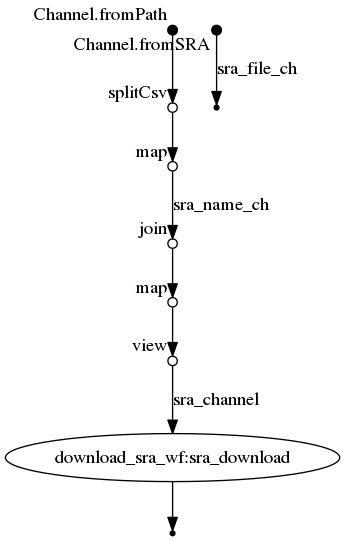

# Workflow SRA download


Maintainer: Christian

Email: christian@nanozoo.org

# Installation

**One time installation only, to use private nextflow repos**

* create git access token [here](https://github.com/settings/tokens)
    * [x] **repo** <- click on this option
    * give it a name (e.g. nextflow) and **Generate token**
* do ``nano ~/.nextflow/scm`` and include

```java
providers {
    github {
        user = 'username'
        password = 'Personal API token'  } }
```


# Execution example

````
nextflow run main.nf --SRA SRA-example-input.csv
````

# Example csv

```csv
ger04,ERR3656076
ger03,ERR3656074
ger01,ERR3654113
```

# Flowchart

